# Сети в Linux

Настройка сетей в Linux на виртуальных машинах.

## Contents

1. [Инструмент ipcalc](#part-1-инструмент-ipcalc)
2. [Статическая маршрутизация между двумя машинами](#part-2-статическая-маршрутизация-между-двумя-машинами)
3. [Утилита iperf3](#part-3-утилита-iperf3)
4. [Сетевой экран](#part-4-сетевой-экран)
5. [Статическая маршрутизация сети](#part-5-статическая-маршрутизация-сети)
6. [Динамическая настройка IP с помощью DHCP](#part-6-динамическая-настройка-ip-с-помощью-dhcp)
7. [NAT](#part-7-nat)
8. [Допополнительно. Знакомство с SSH Tunnels](#part-8-дополнительно-знакомство-с-ssh-tunnels)

## Part 1. Инструмент **ipcalc**
`-` Итак, начнём наше погружение в удивительный мир сетей со знакомства с IP адресами. А использовать для этого мы будем инструмент **ipcalc**.

**== Задание ==**

##### Поднять виртуальную машину (далее -- ws1)

#### 1.1. Сети и маски
##### Определить и записать в отчёт:
##### 1) адрес сети *192.167.38.54/13*

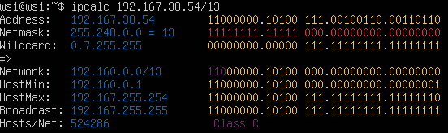

##### 2) перевод маски *255.255.255.0* в префиксную и двоичную запись, */15* в обычную и двоичную, *11111111.11111111.11111111.11110000* в обычную и префиксную

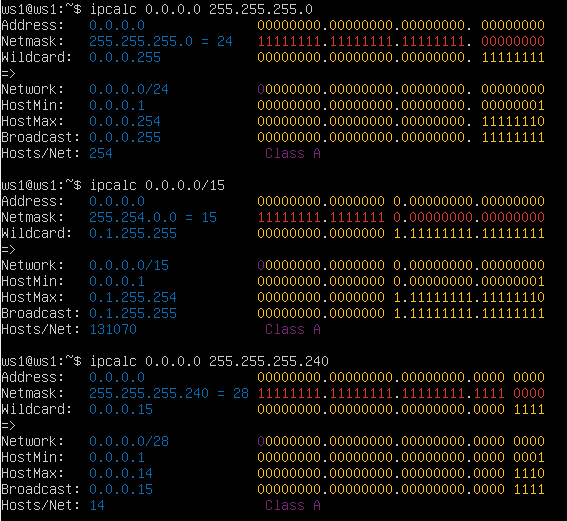

##### 3) минимальный и максимальный хост в сети *12.167.38.4* при масках: */8*, *11111111.11111111.00000000.00000000*, *255.255.254.0* и */4*

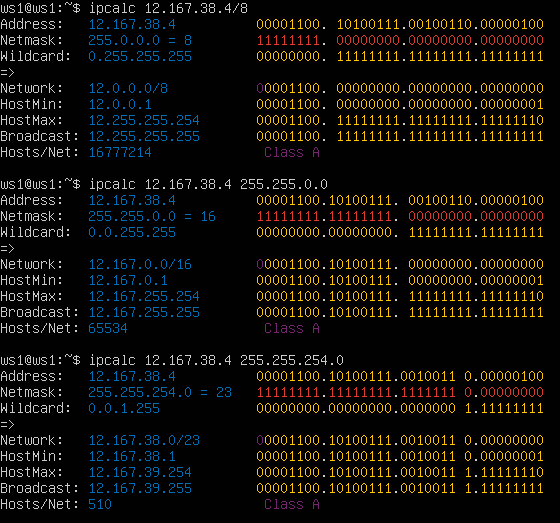

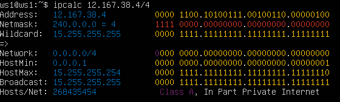

#### 1.2. localhost
##### Определить и записать в отчёт, можно ли обратиться к приложению, работающему на localhost, со следующими IP: *194.34.23.100*, *127.0.0.2*, *127.1.0.1*, *128.0.0.1*

Адреса 127.0.0.1 как и вся /8 сеть это loopback(обратная петля), адрес такого компьютера, с которого отправлен запрос. Имя localhost как правило присвоено именно этому адресу

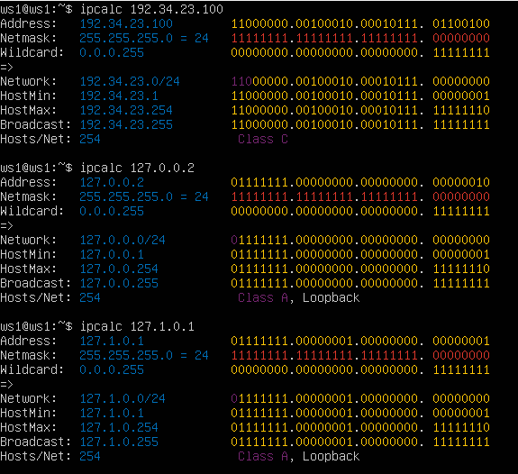

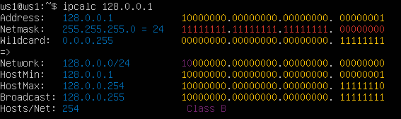

#### 1.3. Диапазоны и сегменты сетей
##### Определить и записать в отчёт:
##### 1) какие из перечисленных IP можно использовать в качестве публичного, а какие только в качестве частных: *10.0.0.45*, *134.43.0.2*, *192.168.4.2*, *172.20.250.4*, *172.0.2.1*, *192.172.0.1*, *172.68.0.2*, *172.16.255.255*, *10.10.10.10*, *192.169.168.1*

Есть специальные диапазоны адресов, которые можно свободно использовать в своих сетях -
- 10.0.0.0 - 10.255.255.255
- 100.64.0.0 - 100.127.255.255
- 172.16.0.0 - 172.31.255.255
- 192.168.0.0 - 192.168.255.255

Это так называемые серые или частные IP адреса. Эти адреса не маршрутизируются в глобальной сети!
Т.е. у вас может быть адрес 192.168.0.1, у вашего соседа такой же адрес, и вообще миллионы устройств с таким адресом.
Но попасть на такой адрес можно только из локальной сети, из интернета он недоступен.

А все остальные кроме loopback, частных и еще некоторных специальных маршрутизируются в глобальной сети.

В качестве частных:
- 10.0.0.45, 192.168.4.2, 172.20.250.4, 172.16.255.255, 10.10.10.10
В качестве публичных:
- 134.43.0.2, 172.0.2.1, 192.172.0.1, 172.68.0.2, 192.169.168.1

##### 2) какие из перечисленных IP адресов шлюза возможны у сети *10.10.0.0/18*: *10.0.0.1*, *10.10.0.2*, *10.10.10.10*, *10.10.100.1*, *10.10.1.255*

Возможны:
- 10.0.0.2, 10.10.10.10, 10.10.1.255
Не возможны:
- 10.0.0.1, 10.10.100.1

## Part 2. Статическая маршрутизация между двумя машинами

`-` Теперь разберёмся, как связать две машины, используя статическую маршрутизацию.

**== Задание ==**

##### Поднять две виртуальные машины (далее -- ws1 и ws2)

##### С помощью команды `ip a` посмотреть существующие сетевые интерфейсы
- В отчёт поместить скрин с вызовом и выводом использованной команды.

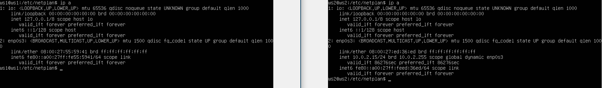

##### Описать сетевой интерфейс, соответствующий внутренней сети, на обеих машинах и задать следующие адреса и маски: ws1 - *192.168.100.10*, маска */16*, ws2 - *172.24.116.8*, маска */12*
- В отчёт поместить скрины с содержанием изменённого файла *etc/netplan/00-installer-config.yaml* для каждой машины.

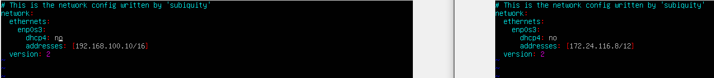

##### Выполнить команду `netplan apply` для перезапуска сервиса сети
- В отчёт поместить скрин с вызовом и выводом использованной команды.

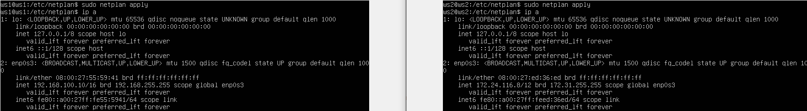

#### 2.1. Добавление статического маршрута вручную
##### Добавить статический маршрут от одной машины до другой и обратно при помощи команды вида `ip r add`
##### Пропинговать соединение между машинами
- В отчёт поместить скрин с вызовом и выводом использованных команд.

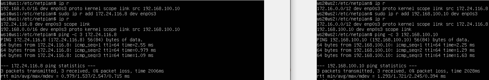

#### 2.2. Добавление статического маршрута с сохранением
##### Перезапустить машины
##### Добавить статический маршрут от одной машины до другой с помощью файла *etc/netplan/00-installer-config.yaml*
- В отчёт поместить скрин с содержанием изменённого файла *etc/netplan/00-installer-config.yaml*.

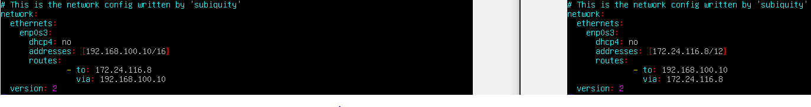

##### Пропинговать соединение между машинами
- В отчёт поместить скрин с вызовом и выводом использованной команды.

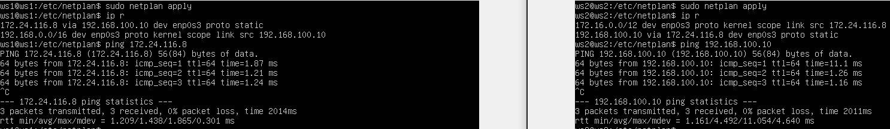

## Part 3. Утилита **iperf3**

`-` Теперь, когда мы связали две машины, ответь мне: что самое важное при передаче информации между машинами?

`-` Скорость соединения?

`-` Всё верно. Будем её проверять с помощью утилиты **iperf3**.

**== Задание ==**

*В данном задании используются виртуальные машины ws1 и ws2 из Части 2*

#### 3.1. Скорость соединения
##### Перевести и записать в отчёт: 8 Mbps в MB/s, 100 MB/s в Kbps, 1 Gbps в Mbps

- 8 Mbps = 1MBps
- 100 MBps = 800000 Kbps
- 1 Gbps = 1000 Mbps

#### 3.2. Утилита **iperf3**
##### Измерить скорость соединения между ws1 и ws2
- В отчёт поместить скрины с вызовом и выводом использованных команд.

Измерение в прямом направлении.

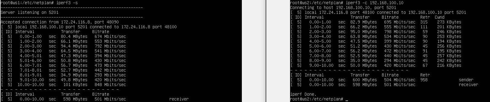

Измерение в обратном направлении.

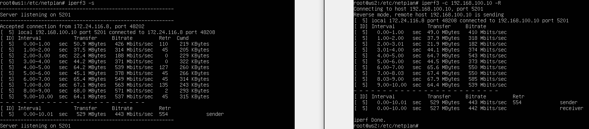

## Part 4. Сетевой экран

`-` После соединения машин, перед нами стоит следующая задача: контролировать информацию, проходящую по соединению. Для этого используются сетевые экраны.

**== Задание ==**

*В данном задании используются виртуальные машины ws1 и ws2 из Части 2*

#### 4.1. Утилита **iptables**
##### Создать файл */etc/firewall.sh*, имитирующий фаерволл, на ws1 и ws2:
```shell
#!/bin/sh

# Удаление всех правил в таблице "filter" (по-умолчанию).
iptables –F
iptables -X
```
##### Нужно добавить в файл подряд следующие правила:
##### 1) на ws1 применить стратегию когда в начале пишется запрещающее правило, а в конце пишется разрешающее правило (это касается пунктов 4 и 5)
##### 2) на ws2 применить стратегию когда в начале пишется разрешающее правило, а в конце пишется запрещающее правило (это касается пунктов 4 и 5)
##### 3) открыть на машинах доступ для порта 22 (ssh) и порта 80 (http)
##### 4) запретить *echo reply* (машина не должна "пинговаться”, т.е. должна быть блокировка на OUTPUT)
##### 5) разрешить *echo reply* (машина должна "пинговаться")
- В отчёт поместить скрины с содержанием файла */etc/firewall* для каждой машины.

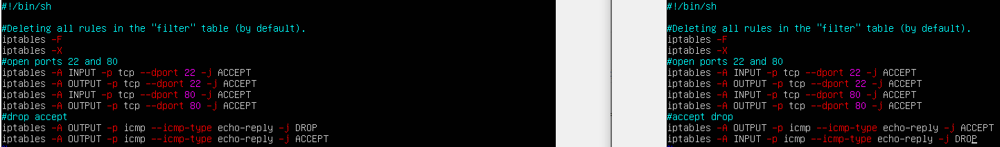

##### Запустить файлы на обеих машинах командами `chmod +x /etc/firewall.sh` и `/etc/firewall.sh`
- В отчёт поместить скрины с запуском обоих файлов.
- В отчёте описать разницу между стратегиями, применёнными в первом и втором файлах.

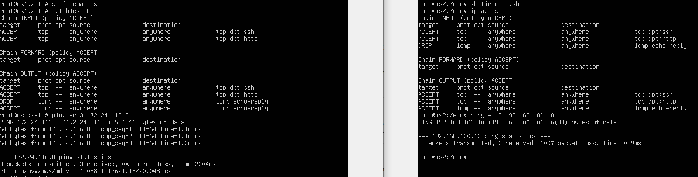

В первом файле используемая стратегия заключается в том, чтобы запретить весь трафик по умолчанию, а затем разрешить
определенный трафик на определенных портах. Это типичный пример подхода "запретить по умолчанию" к настройке брандмауэра.
В этой стратегии весь трафик блокируется по умолчанию, если он явно не разрешен.

С другой стороны, во втором файле используемая стратегия заключается в разрешении всего трафика по умолчанию,
а затем запрете определенного трафика на определенных портах. Это пример подхода "разрешить по умолчанию" к настройке брандмауэра.
В этой стратегии весь трафик разрешен по умолчанию, если он явно не запрещен.

Основное различие между этими двумя стратегиями заключается в подходе к обеспечению безопасности. Подход с запретом по умолчанию 
обычно считается более безопасным, поскольку он гарантирует, что только явно разрешенный трафик пропускается через брандмауэр. 
Однако управлять этим может быть сложнее, поскольку каждый разрешенный трафик должен быть явно настроен. Подход, основанный на 
разрешении по умолчанию, хотя и проще в управлении, может быть более гибким.

#### 4.2. Утилита **nmap**
##### Командой **ping** найти машину, которая не "пингуется", после чего утилитой **nmap** показать, что хост машины запущен
*Проверка: в выводе nmap должно быть сказано: `Host is up`*
- В отчёт поместить скрины с вызовом и выводом использованных команд **ping** и **nmap**.

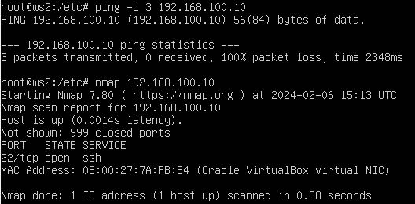

## Part 5. Статическая маршрутизация сети

`-` Пока что мы соединяли всего две машины, но теперь пришло время для статической маршрутизации целой сети.

**== Задание ==**

Сеть: \


##### Поднять пять виртуальных машин (3 рабочие станции (ws11, ws21, ws22) и 2 роутера (r1, r2))

#### 5.1. Настройка адресов машин
##### Настроить конфигурации машин в *etc/netplan/00-installer-config.yaml* согласно сети на рисунке.
- В отчёт поместить скрины с содержанием файла *etc/netplan/00-installer-config.yaml* для каждой машины.

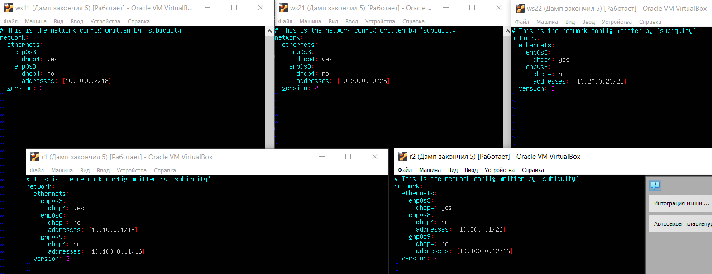

##### Перезапустить сервис сети. Если ошибок нет, то командой `ip -4 a` проверить, что адрес машины задан верно. Также пропинговать ws22 с ws21. Аналогично пропинговать r1 с ws11.
- В отчёт поместить скрины с вызовом и выводом использованных команд.

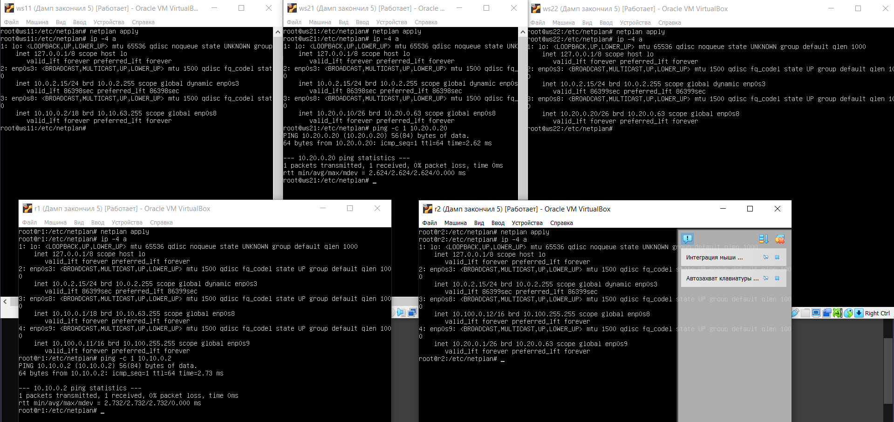

#### 5.2. Включение переадресации IP-адресов.
##### Для включения переадресации IP, выполните команду на роутерах:
`sysctl -w net.ipv4.ip_forward=1`
*При таком подходе переадресация не будет работать после перезагрузки системы.*
- В отчёт поместить скрин с вызовом и выводом использованной команды.

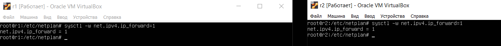

##### Откройте файл */etc/sysctl.conf* и добавьте в него следующую строку:
`net.ipv4.ip_forward = 1`
*При использовании этого подхода, IP-переадресация включена на постоянной основе.*
- В отчёт поместить скрин с содержанием изменённого файла */etc/sysctl.conf*.

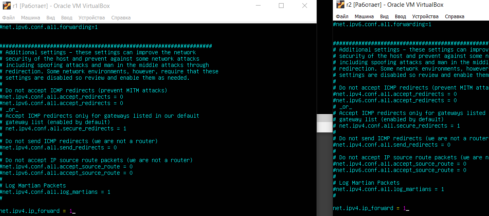

#### 5.3. Установка маршрута по-умолчанию
Пример вывода команды `ip r` после добавления шлюза:
```
default via 10.10.0.1 dev eth0
10.10.0.0/18 dev eth0 proto kernel scope link src 10.10.0.2
```
##### Настроить маршрут по-умолчанию (шлюз) для рабочих станций. Для этого добавить `default` перед IP роутера в файле конфигураций
- В отчёт поместить скрин с содержанием файла *etc/netplan/00-installer-config.yaml*.

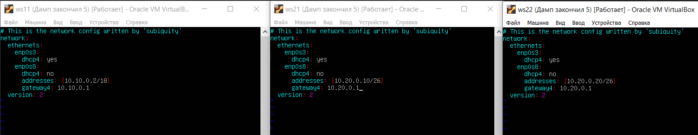

##### Вызвать `ip r` и показать, что добавился маршрут в таблицу маршрутизации
- В отчёт поместить скрин с вызовом и выводом использованной команды.

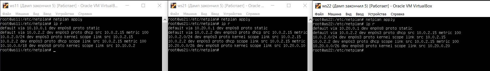

##### Пропинговать с ws11 роутер r2 и показать на r2, что пинг доходит. Для этого использовать команду:
`tcpdump -tn -i eth1`
- В отчёт поместить скрин с вызовом и выводом использованных команд.

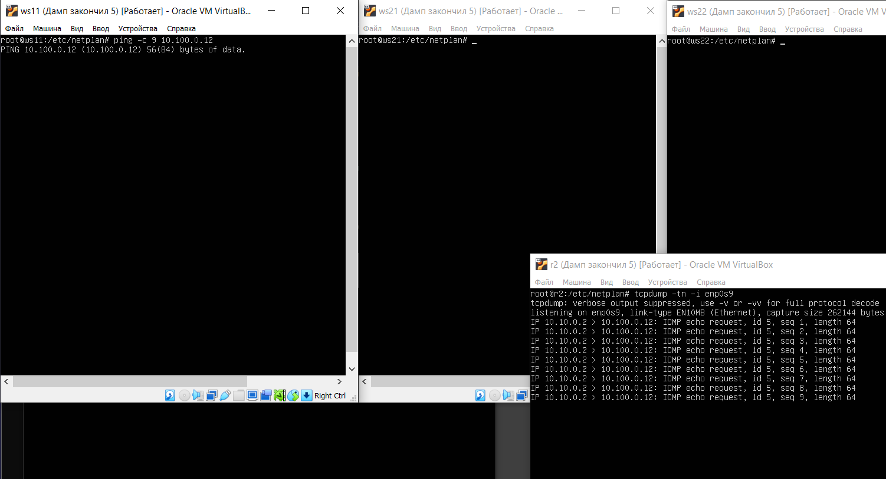

#### 5.4. Добавление статических маршрутов
##### Добавить в роутеры r1 и r2 статические маршруты в файле конфигураций. Пример для r1 маршрута в сетку 10.20.0.0/26:
```shell
# Добавить в конец описания сетевого интерфейса eth1:
- to: 10.20.0.0
  via: 10.100.0.12
```
- В отчёт поместить скрины с содержанием изменённого файла *etc/netplan/00-installer-config.yaml* для каждого роутера.

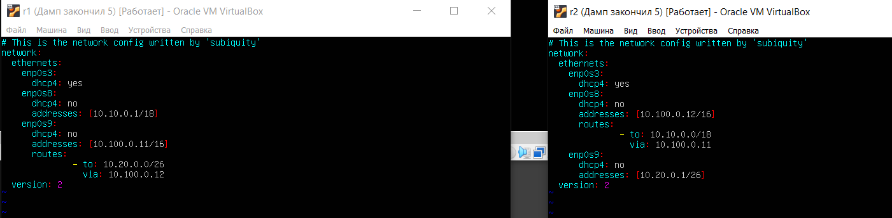

##### Вызвать `ip r` и показать таблицы с маршрутами на обоих роутерах. Пример таблицы на r1:
```
10.100.0.0/16 dev eth1 proto kernel scope link src 10.100.0.11
10.20.0.0/26 via 10.100.0.12 dev eth1
10.10.0.0/18 dev eth0 proto kernel scope link src 10.10.0.1
```
- В отчёт поместить скрин с вызовом и выводом использованной команды.

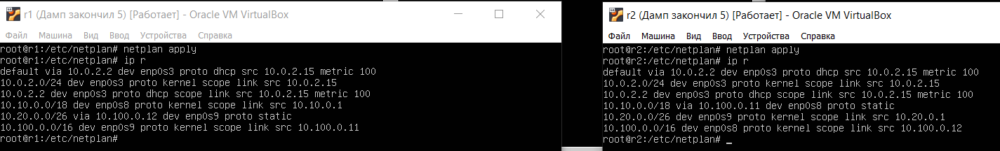

##### Запустить команды на ws11:
`ip r list 10.10.0.0/[маска сети]` и `ip r list 0.0.0.0/0`
- В отчёт поместить скрин с вызовом и выводом использованных команд.

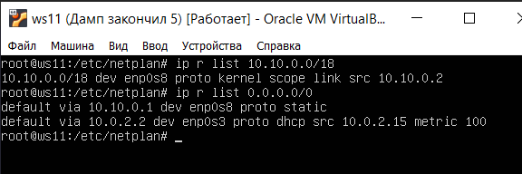

- В отчёте объяснить, почему для адреса 10.10.0.0/\[маска сети\] был выбран маршрут, отличный от 0.0.0.0/0, хотя он попадает под маршрут по-умолчанию.

Маршрут по умолчанию имеет более низкуий приоритет и срабатывает, когда не найден подходящий маршрут в таблице маршрутизации.
0.0.0.0/0 - это немаршрутизируемый адрес, которых можно использовать в разных целях, в основном в качестве адреса по умолчанию или адреса-заполнителя.
Маршрут по умолчанию имеет более низкий приоритет и срабатывает, когда не найден подходящий маршрут в таблице маршрутизации. Для сети 10.10.0.0 мы
создали правило, соответственно используется созданный маршрут. Также можно утсанавливать метрки, чтобы менять приоритеты маршрутов.

#### 5.5. Построение списка маршрутизаторов
Пример вывода утилиты **traceroute** после добавления шлюза:
```
1 10.10.0.1 0 ms 1 ms 0 ms
2 10.100.0.12 1 ms 0 ms 1 ms
3 10.20.0.10 12 ms 1 ms 3 ms
```
##### Запустить на r1 команду дампа:
`tcpdump -tnv -i eth0`
##### При помощи утилиты **traceroute** построить список маршрутизаторов на пути от ws11 до ws21
- В отчёт поместить скрины с вызовом и выводом использованных команд (tcpdump и traceroute).

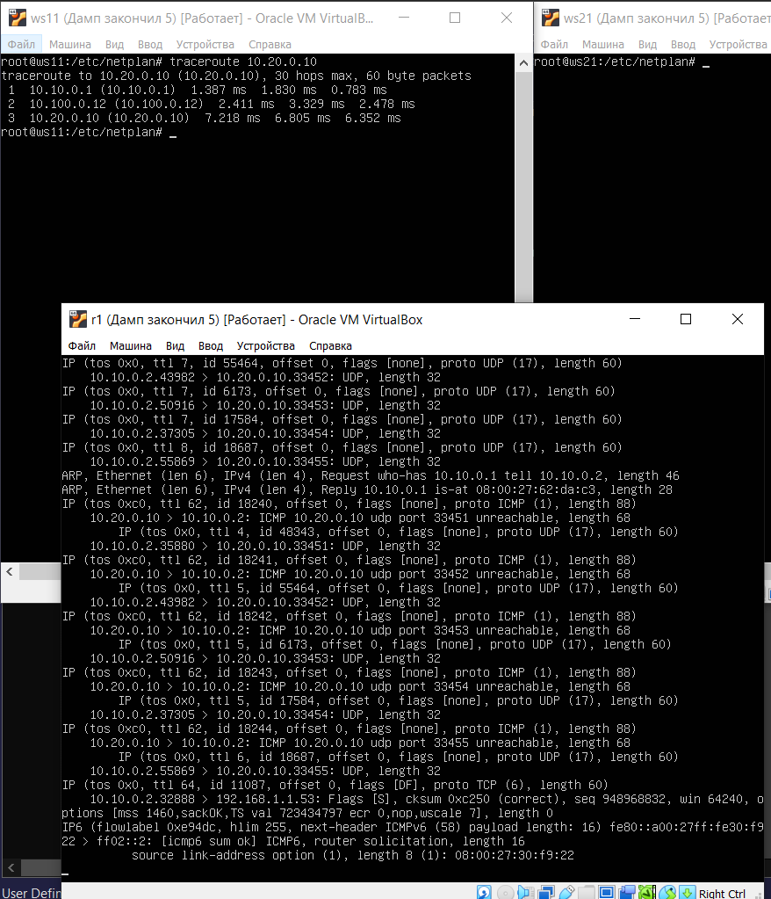

- В отчёте, опираясь на вывод, полученный из дампа на r1, объяснить принцип работы построения пути при помощи **traceroute**.

> Принцип работы traceroute: Утилита отправляет целевому узлу несколько пакетов с временем жизни 1 (TTL, time to live - число переходов, которые пакет может осуществить до своего исчезновения). Следующий маршрутизатор принимает пакеты и отправляет сообщение, что время жизни пакетов истекло. traceroute фиксирует адрес этого маршрутизатора и отправляет следующие пакеты, уже с TTL 2. Так, каждый раз увеличивая TTL на 1, traceroute составляет список маршрутизаторов, через которе прошли пакеты до целевого узла. Для определения промежуточных маршрутизаторов traceroute отправляет серию пакетов данных целевому узлу, при этом каждый раз увеличивая на 1 значение поля TTL («время жизни»). Это поле обычно указывает максимальное количество маршрутизаторов, которое может быть пройдено пакетом. Первый пакет отправляется с TTL, равным 1, и поэтому первый же маршрутизатор возвращает обратно сообщение ICMP, указывающее на невозможность доставки данных. Traceroute фиксирует адрес маршрутизатора, а также время между отправкой пакета и получением ответа (эти сведения выводятся на монитор компьютера). Затем traceroute повторяет отправку пакета, но уже с TTL, равным 2, что позволяет первому маршрутизатору пропустить пакет дальше.

#### 5.6. Использование протокола **ICMP** при маршрутизации
##### Запустить на r1 перехват сетевого трафика, проходящего через eth0 с помощью команды:
`tcpdump -n -i eth0 icmp`
##### Пропинговать с ws11 несуществующий IP (например, *10.30.0.111*) с помощью команды:
`ping -c 1 10.30.0.111`
- В отчёт поместить скрин с вызовом и выводом использованных команд.

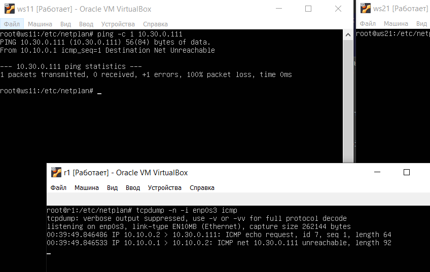


##### Сохранить дампы образов виртуальных машин
**p.s. Ни в коем случае не сохранять дампы в гит!**

## Part 6. Динамическая настройка IP с помощью **DHCP**

`-` Следующим нашим шагом будет более подробное знакомство со службой **DHCP**, которую ты уже знаешь.

**== Задание ==**

*В данном задании используются виртуальные машины из Части 5*

##### Для r2 настроить в файле */etc/dhcp/dhcpd.conf* конфигурацию службы **DHCP**:
##### 1) указать адрес маршрутизатора по-умолчанию, DNS-сервер и адрес внутренней сети. Пример файла для r2:
```shell
subnet 10.100.0.0 netmask 255.255.0.0 {}

subnet 10.20.0.0 netmask 255.255.255.192
{
    range 10.20.0.2 10.20.0.50;
    option routers 10.20.0.1;
    option domain-name-servers 10.20.0.1;
}
```

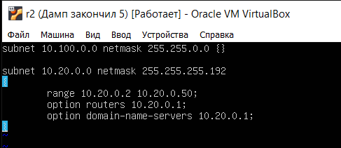

##### 2) в файле *resolv.conf* прописать `nameserver 8.8.8.8.`
- В отчёт поместить скрины с содержанием изменённых файлов.

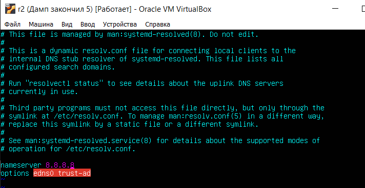

##### Перезагрузить службу **DHCP** командой `systemctl restart isc-dhcp-server`. Машину ws21 перезагрузить при помощи `reboot` и через `ip a` показать, что она получила адрес. Также пропинговать ws22 с ws21.
- В отчёт поместить скрины с вызовом и выводом использованных команд.

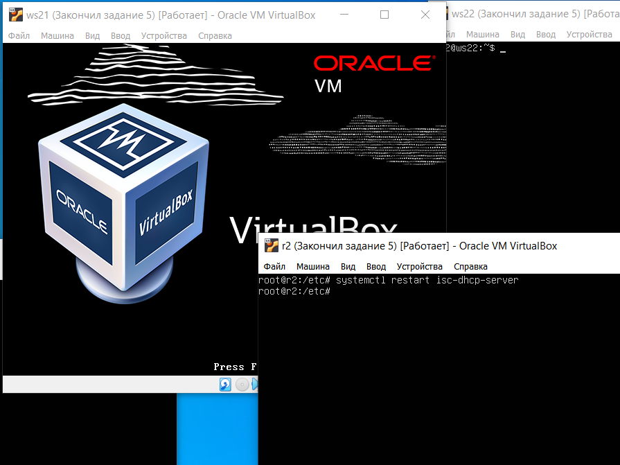

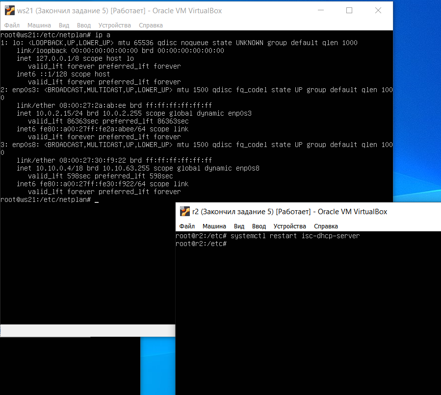

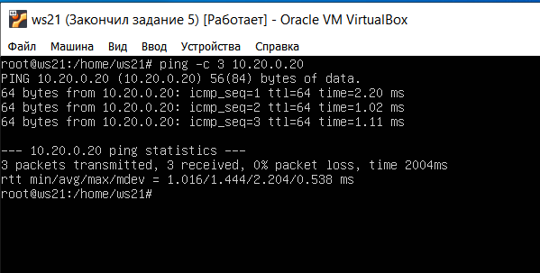

##### Указать MAC адрес у ws11, для этого в *etc/netplan/00-installer-config.yaml* надо добавить строки: `macaddress: 10:10:10:10:10:BA`, `dhcp4: true`
- В отчёт поместить скрин с содержанием изменённого файла *etc/netplan/00-installer-config.yaml*.
##### Для r1 настроить аналогично r2, но сделать выдачу адресов с жесткой привязкой к MAC-адресу (ws11). Провести аналогичные тесты
- В отчёте этот пункт описать аналогично настройке для r2.

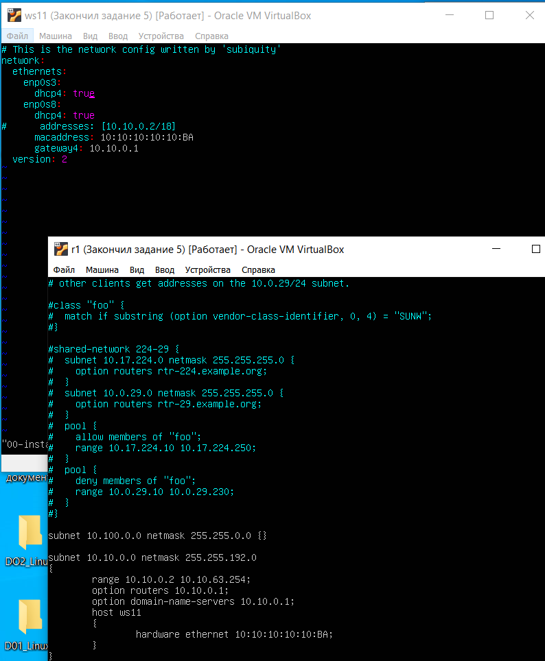

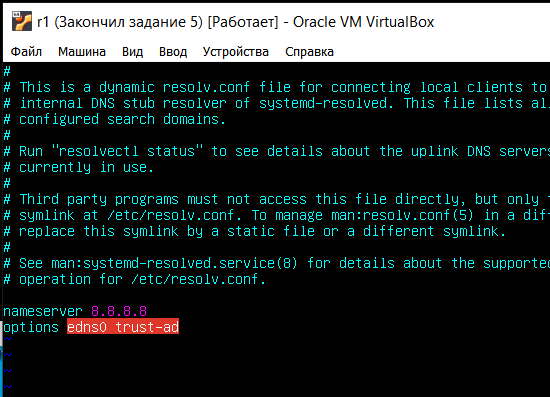

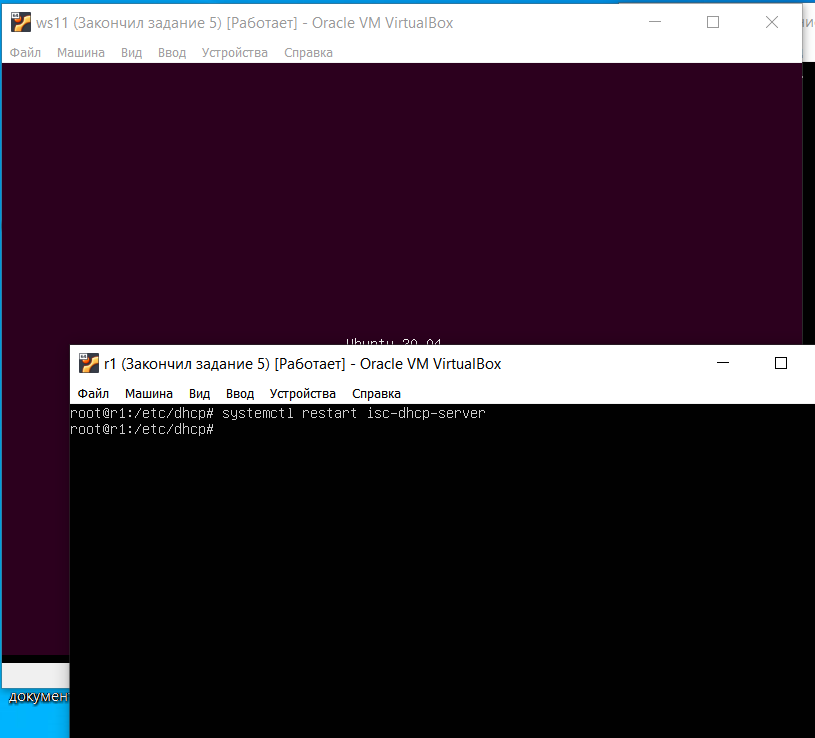

##### Запросить с ws21 обновление ip адреса
- В отчёте поместить скрины ip до и после обновления.
- В отчёте описать, какими опциями **DHCP** сервера пользовались в данном пункте.

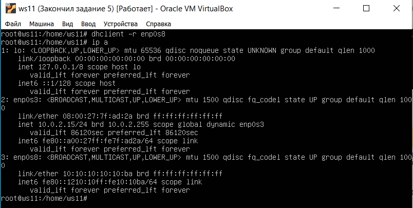

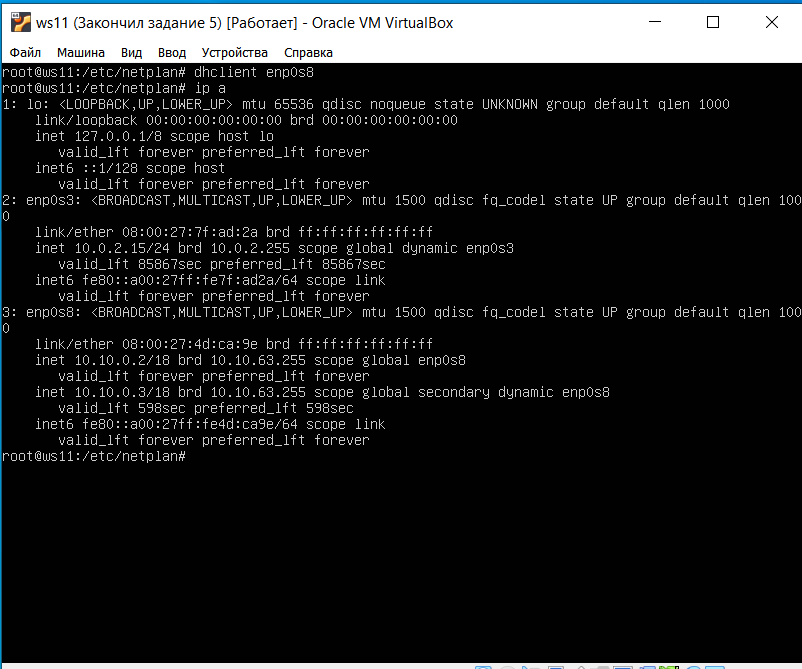

##### Сохранить дампы образов виртуальных машин
**p.s. Ни в коем случае не сохранять дампы в гит!**

## Part 7. **NAT**
`-` Ну и, наконец, в качестве вишенки на торте, я расскажу тебе про механизм преобразования адресов.

**== Задание ==**

*В данном задании используются виртуальные машины из Части 5*
##### В файле */etc/apache2/ports.conf* на ws22 и r1 изменить строку `Listen 80` на `Listen 0.0.0.0:80`, то есть сделать сервер Apache2 общедоступным
- В отчёт поместить скрин с содержанием изменённого файла.

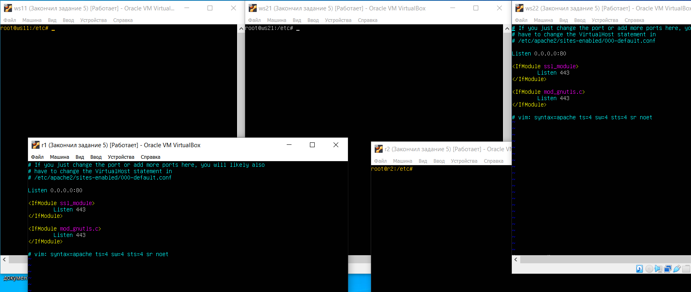

##### Запустить веб-сервер Apache командой `service apache2 start` на ws22 и r1
- В отчёт поместить скрины с вызовом и выводом использованной команды.

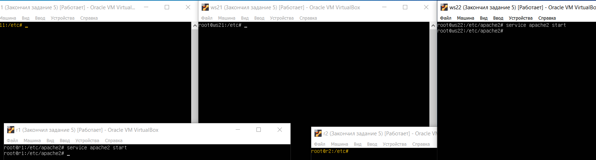

##### Добавить в фаервол, созданный по аналогии с фаерволом из Части 4, на r2 следующие правила:
##### 1) удаление правил в таблице filter - `iptables -F`
##### 2) удаление правил в таблице "NAT" - `iptables -F -t nat`
##### 3) отбрасывать все маршрутизируемые пакеты - `iptables --policy FORWARD DROP`
##### Запускать файл также, как в Части 4
##### Проверить соединение между ws22 и r1 командой `ping`
*При запуске файла с этими правилами, ws22 не должна "пинговаться" с r1*
- В отчёт поместить скрины с вызовом и выводом использованной команды.

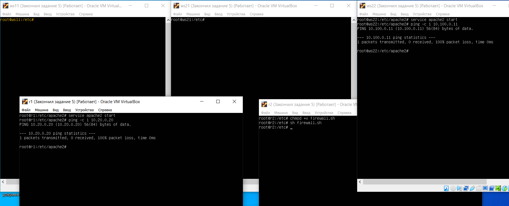

##### Добавить в файл ещё одно правило:
##### 4) разрешить маршрутизацию всех пакетов протокола **ICMP**
##### Запускать файл также, как в Части 4
##### Проверить соединение между ws22 и r1 командой `ping`
*При запуске файла с этими правилами, ws22 должна "пинговаться" с r1*
- В отчёт поместить скрины с вызовом и выводом использованной команды.

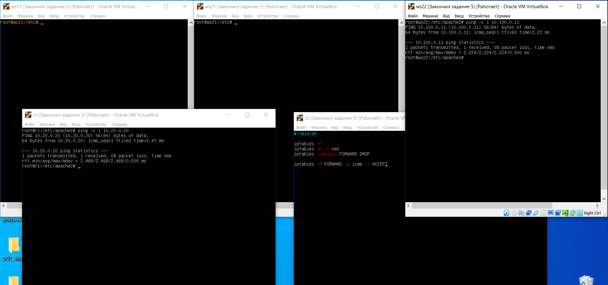

##### Добавить в файл ещё два правила:
##### 5) включить **SNAT**, а именно маскирование всех локальных ip из локальной сети, находящейся за r2 (по обозначениям из Части 5 - сеть 10.20.0.0)
*Совет: стоит подумать о маршрутизации внутренних пакетов, а также внешних пакетов с установленным соединением*
##### 6) включить **DNAT** на 8080 порт машины r2 и добавить к веб-серверу Apache, запущенному на ws22, доступ извне сети
*Совет: стоит учесть, что при попытке подключения возникнет новое tcp-соединение, предназначенное ws22 и 80 порту*
- В отчёт поместить скрин с содержанием изменённого файла.
##### Запускать файл также, как в Части 4
*Перед тестированием рекомендуется отключить сетевой интерфейс **NAT** (его наличие можно проверить командой `ip a`) в VirtualBox, если он включен*
##### Проверить соединение по TCP для **SNAT**, для этого с ws22 подключиться к серверу Apache на r1 командой:
`telnet [адрес] [порт]`
##### Проверить соединение по TCP для **DNAT**, для этого с r1 подключиться к серверу Apache на ws22 командой `telnet` (обращаться по адресу r2 и порту 8080)
- В отчёт поместить скрины с вызовом и выводом использованных команд.

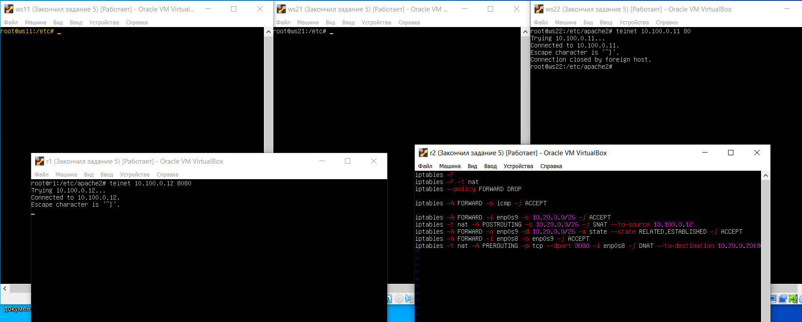

##### Сохранить дампы образов виртуальных машин
**p.s. Ни в коем случае не сохранять дампы в гит!**

## Part 8. Дополнительно. Знакомство с **SSH Tunnels**

`-` Пожалуй, на этом у меня всё. Может у тебя появились ещё какие-то вопросы?

`-` Да, я хотел спросить ещё об одной вещи. На работе я краем уха услышал, что в моей компании есть некие проекты по обучению. Подробностей я не знаю, но очень хочется взглянуть... Вдруг будет полезно

`-` Действительно интересно, но как в этом помогу тебе я?

`-` Дело в том, что, чтобы добраться до этих проектов, нужно получить доступ к закрытой сети. Можешь посоветовать что-нибудь по этому поводу?

`-` Ну ты, конечно, даёшь... Не уверен на все сто, что это поможет, но могу рассказать тебе про **SSH Tunnels**.

**== Задание ==**

*В данном задании используются виртуальные машины из Части 5*

##### Запустить на r2 фаервол с правилами из Части 7
##### Запустить веб-сервер **Apache** на ws22 только на localhost (то есть в файле */etc/apache2/ports.conf* изменить строку `Listen 80` на `Listen localhost:80`)

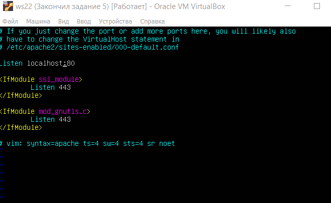

##### Воспользоваться *Local TCP forwarding* с ws21 до ws22, чтобы получить доступ к веб-серверу на ws22 с ws21

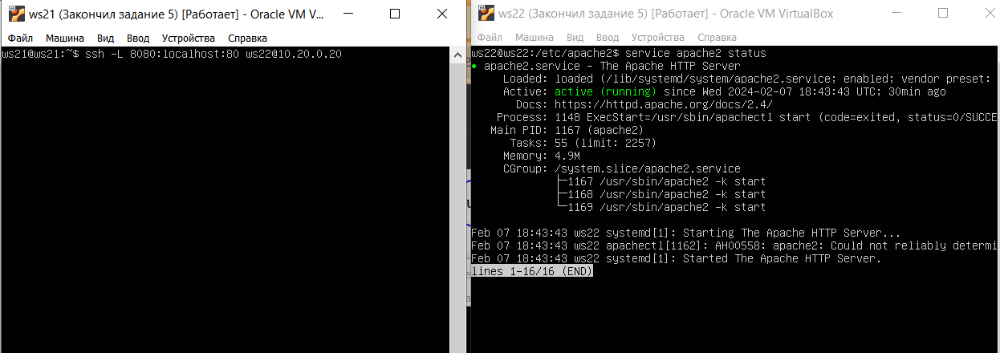

> на машине ws21 под пользователем ws22 машины ws22

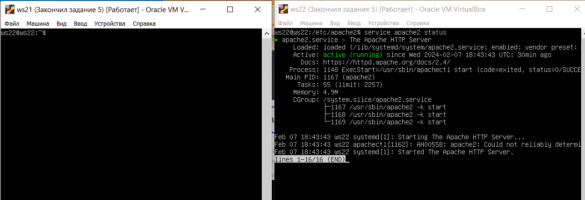

> проверка подключения

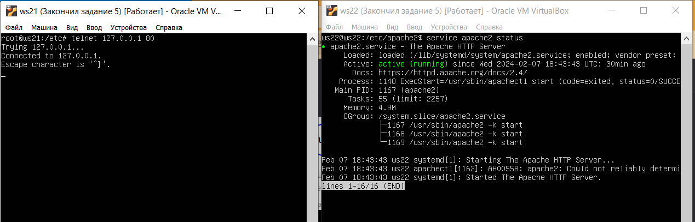

##### Воспользоваться *Remote TCP forwarding* c ws11 до ws22, чтобы получить доступ к веб-серверу на ws22 с ws11
##### Для проверки, сработало ли подключение в обоих предыдущих пунктах, перейдите во второй терминал (например, клавишами Alt + F2) и выполните команду:
`telnet 127.0.0.1 [локальный порт]`
- В отчёте описать команды, необходимые для выполнения этих четырёх пунктов, а также приложить скриншоты с их вызовом и выводом.

> команда подключения

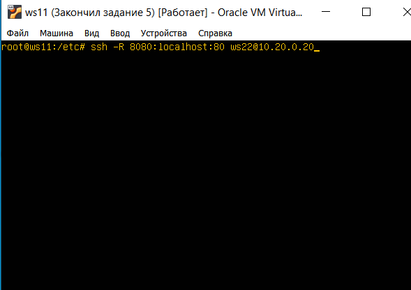

> на машине ws11 под пользователем ws22 машины ws22

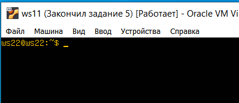

> проверка подключения

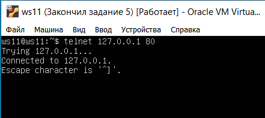

##### Сохранить дампы образов виртуальных машин
**p.s. Ни в коем случае не сохранять дампы в гит!**

## Chapter IV

`-` Спасибо тебе большое за помощь!

`-` Всегда пожалуйста! Мне тоже не было лишним вспомнить основы администрирования. Я решил освоить что-нибудь новое и заняться DevOps'ом.

`-` Ого! Уже нашёл, куда устроиться?

`-` Да, правда придётся переехать. Так что, в следующий раз тебе придётся учиться всему самому.

`-` Рано или поздно мне всё равно пришлось бы начать, так что, может, это только к лучшему. Потом обязательно созвонимся - расскажешь о своих успехах!

`-` А ты о своих!

\> *Вы ещё какое-то время болтаете на прочие темы, слушая приятную музыку и допивая заказанные напитки, после чего прощаетесь...*

💡 [Нажми тут](https://forms.yandex.ru/cloud/6418183eeb614624a5cee6b5/), **чтобы поделиться с нами обратной связью на этот проект**. Это анонимно и поможет команде Педаго сделать твоё обучение лучше.
